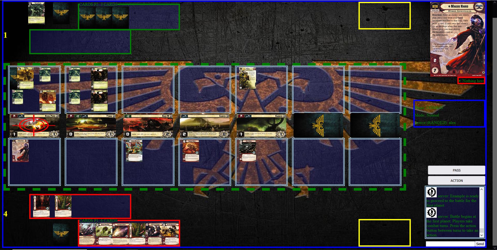

# Iridial.net - Play the Warhammer 40,000: Conquest LCG in your browser!

# Live from the Traxis Sector:

All cards supported. (Though not all working exactly as written; getting there though!)

# What is this?

Warhammer 40k Conquest card game. See the Board Game Geek page: 
https://boardgamegeek.com/boardgame/156776/warhammer-40000-conquest

Here is a link to The Hive Tyrant's tutorial for the game: https://www.youtube.com/watch?v=NE8NL9PfjXU

# What is the current progress?

See the online spreadsheet: 
https://docs.google.com/spreadsheets/d/19WVZDINaXXJkV-hodJnYNgk2xx7UQQGF9aBtdWPVL_k/edit?gid=0#gid=0

# How can I run it myself?

I assume you already have some knowledge of git, python and docker.

You will need Python 3.13.1 and docker installed. Please keep in mind that, depending on how you installed python, you may need to replace "py" in any given commands with "python", "python3" or similar.

Open up a command terminal. In it:

Git clone the repo and cd into it. To do this you can run

~~~
git clone https://github.com/C-C-Coalback/Conquest-LCG-Site ConquestSite
cd ConquestSite
~~~

Run
~~~
py -m pip install -r requirements.txt
~~~
to install dependencies.

Open up a second command terminal. Launch docker. In one terminal, run 
~~~
docker run --rm -p 6379:6379 redis:7
~~~

Then, run 
~~~
py manage.py makemigrations
py manage.py migrate
~~~
to create the user database.

To run tests, navigate to the all_tests.py file and run 
~~~
py all_tests.py
~~~

If you are wanting to run this for development purposes,
navigate to the manage.py file, and run

~~~
daphne -b 127.0.0.1 -p 8000 conquest_site.asgi:application  
~~~

then navigate to 127.0.0.1:8000 in your internet browser.

If you want to run this on your local network, replace 127.0.0.1 with your ip address.

# Disclaimer

Warhammer 40,000: Conquest is a trademark of Fantasy Flight 
Publishing, Inc. and/or Games Workshop Group. This project is 
not affiliated with either Fantasy Flight Games or Games 
Workshop Group. 
